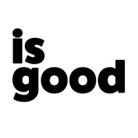

# isgood-webapp

🎉 New isgood WebApp (re-)build for 2022 Launch 🚀

---

## Docs 

📖 [docs.isgood.ai](https://docs.isgood.ai/)

<!--
*** The isgood.ai ReadME is based on ->
*** Thanks for checking out the Best-README-Template. If you have a suggestion
*** that would make this better, please fork the repo and create a pull request
*** or simply open an issue with the tag "enhancement".
*** Don't forget to give the project a star!
*** Thanks again! Now go create something AMAZING! :D
-->

<!-- PROJECT SHIELDS -->
<!--
*** I'm using markdown "reference style" links for readability.
*** Reference links are enclosed in brackets [ ] instead of parentheses ( ).
*** See the bottom of this document for the declaration of the reference variables
*** for contributors-url, forks-url, etc. This is an optional, concise syntax you may use.
*** https://www.markdownguide.org/basic-syntax/#reference-style-links
-->
[![Contributors][contributors-shield]][contributors-url]
[![Forks][forks-shield]][forks-url]
[![Stargazers][stars-shield]][stars-url]
[![Issues][issues-shield]][issues-url]
[![MIT License][license-shield]][license-url]
[![LinkedIn][linkedin-shield]][linkedin-url]

<!-- PROJECT LOGO -->
 

  

<h3 align="center">isgood.ai WebApp</h3>

  

    🎉 New isgood WebApp (re-)build for 2022 Launch 🚀
     
    <a href="https://docs.isgood.ai"><strong>Explore the docs »</strong></a>
     
     
    <a href="https://docs.isgood.ai/product-outline#explainer-deck">Usage</a>
    ·
    <a href="https://github.com/for-good/isgood-webapp/issues/new?assignees=&labels=&template=bug_report.md&title=">Report Bug</a>
    ·
    <a href="https://github.com/for-good/isgood-webapp/issues/new?assignees=&labels=&template=feature_request.md&title=">Request Feature</a>
  

<!-- TABLE OF CONTENTS -->

  
Table of Contents

  <ol>
    <li>
      <a href="#about-the-project">About The Project</a>
    </li>
    <li>
      <a href="#getting-started">Getting Started</a>
<!--      <ul>
        <li><a href="#prerequisites">Prerequisites</a></li>
        <li><a href="#installation">Installation</a></li>
      </ul> -->
    </li>
<!--    <li><a href="#usage">Usage</a></li> -->
    <li><a href="#roadmap">Dev Roadmap</a></li>
    <li><a href="#contributing">Contributing</a></li>
    <li><a href="#license">License</a></li>
    <li><a href="#contact">Contact</a></li>
    <li><a href="#acknowledgments">Acknowledgments</a>
      <ul>
        <li><a href="#built-with">Built With</a></li>
      </ul>
    </li>
  </ol>

<!-- ABOUT THE PROJECT -->
## About The Project

[![Product Name Screen Shot][product-screenshot]](.github/images/isgood-github-grab.png)

Here's a blank template to get started: To avoid retyping too much info. Do a search and replace with your text editor for the following: `github_username`, `repo_name`, `twitter_handle`, `linkedin_username`, `email_client`, `email`, `project_title`, `project_description`

(<a href="#top">back to top</a>)

<!-- GETTING STARTED -->
## Getting Started

Please see our docs for the latest info @[docs.isgood.ai](https://docs.isgood.ai/)

<!-- USAGE EXAMPLES
## Usage

Use this space to show useful examples of how a project can be used. Additional screenshots, code examples and demos work well in this space. You may also link to more resources.

_For more examples, please refer to the [Documentation](https://example.com)_

(<a href="#top">back to top</a>)

 -->

<!-- ROADMAP -->
## Dev Roadmap

We `build in public` and manage our **Dev Roadmap** as releases.
[View Release Roadmap »](https://docs.isgood.ai/releases).

See the [open issues](https://github.com/for-good/isgood-webapp/issues) for a full list of current dev tasks, features and known issues.

(<a href="#top">back to top</a>)

<!-- CONTRIBUTING -->
## Contributing

As an open source project, we LOVE contributions.

We have some info to get started in our [Contributors Guide »](https://docs.isgood.ai/welcome/contributing)

You can also simply [open an issue](https://github.com/for-good/isgood-webapp/issues/new/choose), or [discuss stuff with us directly](https://github.com/for-good/isgood-webapp/discussions).

We'd also love for you to join us at a community event (starting again soon) or through any of our social media to chat about how you can contribute to isgood!

(<a href="#top">back to top</a>)

<!-- LICENSE -->
## License

Distributed under the GPL3.0 License. See `LICENSE.txt` for more information.

(<a href="#top">back to top</a>)

<!-- CONTACT -->
## Contacts

Max Lynam - [Connect on LinkedIn](https://www.linkedin.com/in/maxlynam/) - email via support@isgood.ai

Project Site: [https://isgood.ai](https://isgood.ai)

(<a href="#top">back to top</a>)

<!-- ACKNOWLEDGMENTS -->
## Acknowledgments

Current Dev & Tech Sponsors
* [Amazee+Lagoon: Host & DevOps Sponsor](https://www.amazee.io/)
* [Github: GitOps Sponsor](https://github.com)
* [AWS: CloudInfra Sponsor](https://aws.amazon.com/)
* [Gitbook: Docs Sponsor](https://gitbook.com)
* [Template for this ReadME](https://github.com/othneildrew/Best-README-Template)

(<a href="#top">back to top</a>)

### Built With

Initial starter services:
* Lagoon
* Drupal 9.2
* PHP 8.0
* NGINX
* Postgres 11

(<a href="#top">back to top</a>)

<!-- MARKDOWN LINKS & IMAGES -->
<!-- https://www.markdownguide.org/basic-syntax/#reference-style-links -->
[contributors-shield]: https://img.shields.io/github/contributors/for-good/isgood-webapp.svg?style=for-the-badge
[contributors-url]: https://github.com/for-good/isgood-webapp/graphs/contributors
[forks-shield]: https://img.shields.io/github/forks/for-good/isgood-webapp.svg?style=for-the-badge
[forks-url]: https://github.com/for-good/isgood-webapp/network/members
[stars-shield]: https://img.shields.io/github/stars/for-good/isgood-webapp.svg?style=for-the-badge
[stars-url]: https://github.com/for-good/isgood-webapp/stargazers
[issues-shield]: https://img.shields.io/github/issues/for-good/isgood-webapp.svg?style=for-the-badge
[issues-url]: https://github.com/for-good/isgood-webapp/issues
[license-shield]: https://img.shields.io/github/license/for-good/isgood-webapp.svg?style=for-the-badge
[license-url]: https://github.com/for-good/isgood-webapp/blob/master/LICENSE.txt
[linkedin-shield]: https://img.shields.io/badge/-LinkedIn-black.svg?style=for-the-badge&logo=linkedin&colorB=555
[linkedin-url]: https://www.linkedin.com/company/isgoodai/
[product-screenshot]: .github/images/isgood-github-grab.png